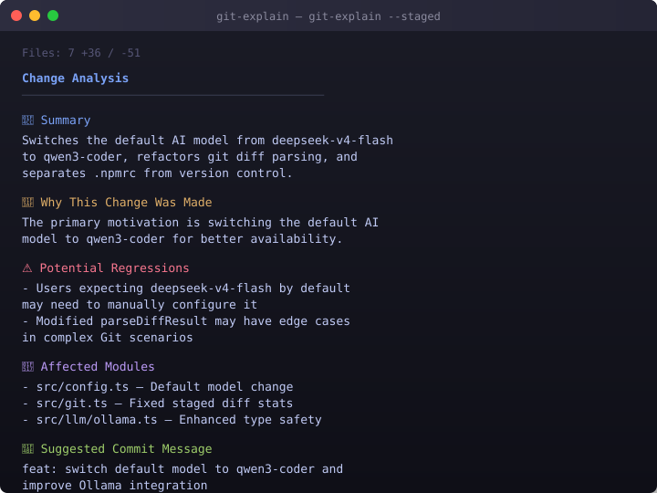

# git-explain

Understand what changed, why it changed, and what risks it introduces — powered by AI.

Instead of `+520 -380`, git-explain tells you _what actually changed_, infers _why_ from repository context, highlights _regressions_ and _affected modules_, and suggests _commit messages_, _PR descriptions_, and _test cases_.

<p align="center">
  
</p>

## Installation

```bash
npm install -g git-explain
```

## Quick Start

On first run, the setup wizard walks you through selecting a model:

```
$ git-explain

Welcome to Git Explain!
  ✓ Git detected
  ✓ Ollama detected

Select AI model:
  1. DeepSeek V4 Flash  (recommended)
  2. Qwen3-Coder
  3. GPT-5              (requires API key)
  4. Claude             (requires API key)
```

Offline models (DeepSeek V4 Flash, Qwen3-Coder) are downloaded automatically via Ollama.

## Usage

```bash
git-explain                    # Full analysis of working tree changes
git-explain --staged           # Staged changes
git-explain HEAD               # Last commit
git-explain abc1234            # Specific commit hash

git-explain -m                 # Commit message only
git-explain -r                 # Risk analysis only

git-explain --offline          # Force offline mode
git-explain --model qwen3-coder:latest
git-explain --setup            # Re-run setup wizard
```

## Sample Output

```
$ git-explain --staged

  Files: 7   +36 / -51

  Change Analysis
──────────────────────────────────────────────────

  📌  Summary
    Switches the default AI model from deepseek-v4-flash
    to qwen3-coder, refactors git diff parsing, and
    separates .npmrc from version control.

  🎯  Why This Change Was Made
    The primary motivation is switching the default AI model
    to qwen3-coder for better availability. Supporting changes
    fix a bug where staged diff stats were incorrectly
    calculated, and clean up configuration management.

  ⚠️  Potential Regressions
    - Users expecting deepseek-v4-flash by default may
      need to manually configure it
    - Modified parseDiffResult may have edge cases in
      complex Git scenarios

  🔗  Affected Modules
    - src/config.ts — Default model change
    - src/git.ts — Fixed staged diff stats calculation
    - src/llm/ollama.ts — Enhanced type safety
    - src/setup.ts — Updated model selection defaults
    - .gitignore / .npmrc.example — Config separation

  💾  Suggested Commit Message
    feat: switch default model to qwen3-coder and
    improve Ollama integration

  📝  PR Description
    This PR switches the default AI model to qwen3-coder,
    refactors the Ollama provider for better type safety,
    fixes staged diff statistics, removes unused code, and
    separates .npmrc from version control for security.

  🧪  Test Cases
    1. Verify qwen3-coder is set as default in config
    2. Test setup wizard initializes with correct default
    3. Validate Ollama model existence checking
    4. Ensure git diff stats work for staged + unstaged
    5. Confirm .npmrc.example contains correct config
```

## Output Sections

| Section | Description |
|---|---|
| Summary | 2-3 sentence overview |
| Why This Change Was Made | Motivation inferred from diff + repository context |
| Potential Regressions | Specific regressions with file references |
| Affected Modules | Directly and indirectly impacted modules |
| Suggested Commit Message | Conventional commit format |
| PR Description | 3-5 sentence PR summary |
| Test Cases | Specific test scenarios to cover |

## Configuration

Config is stored at `~/.git-explain/config.json`. Environment variables override at runtime:

| Variable | Used For |
|---|---|
| `OPENAI_API_KEY` | GPT-5 / OpenAI-compatible |
| `ANTHROPIC_API_KEY` | Claude |
| `OLLAMA_URL` | Custom Ollama endpoint (default: `http://localhost:11434`) |

## Requirements

- Node.js 18+
- Git
- Ollama (for offline models)

## License

Apache 2.0
